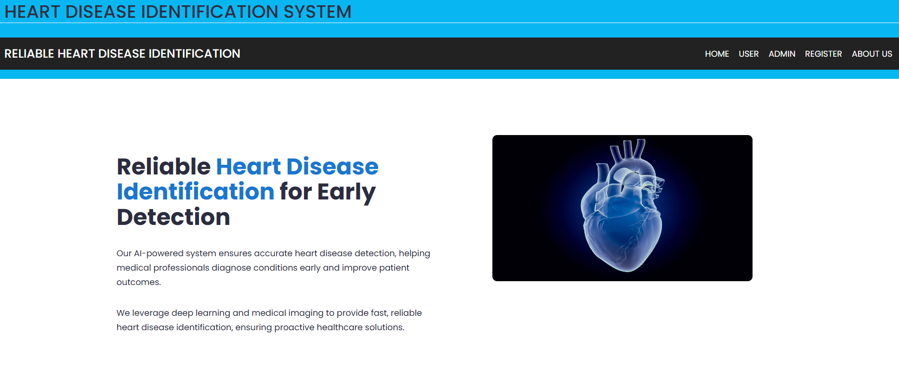
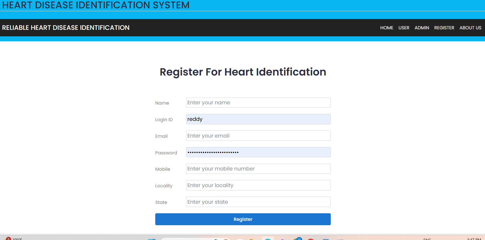
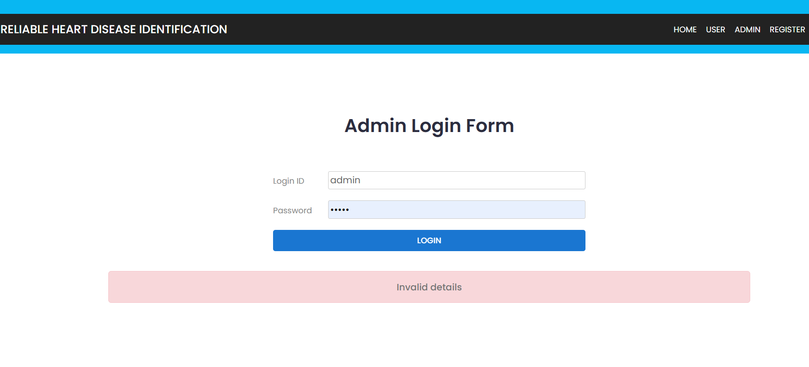
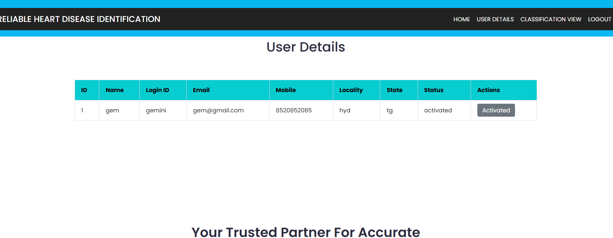
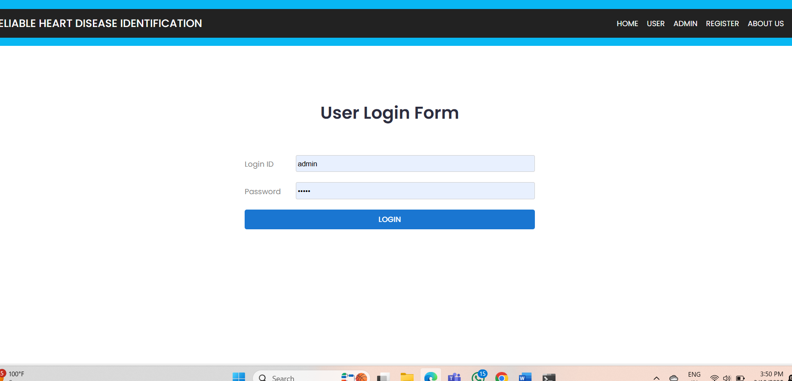
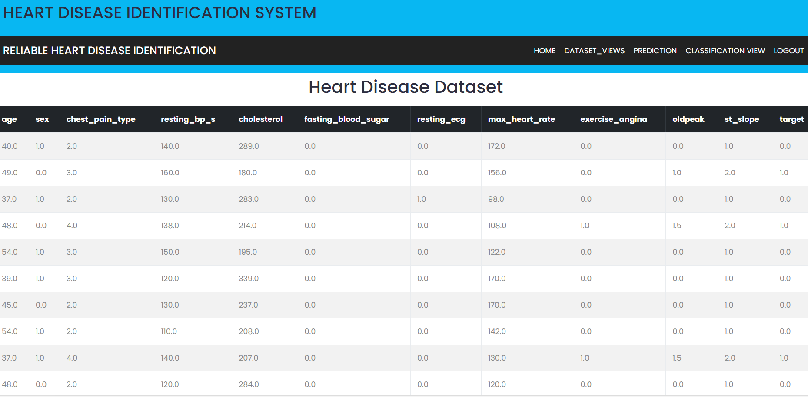
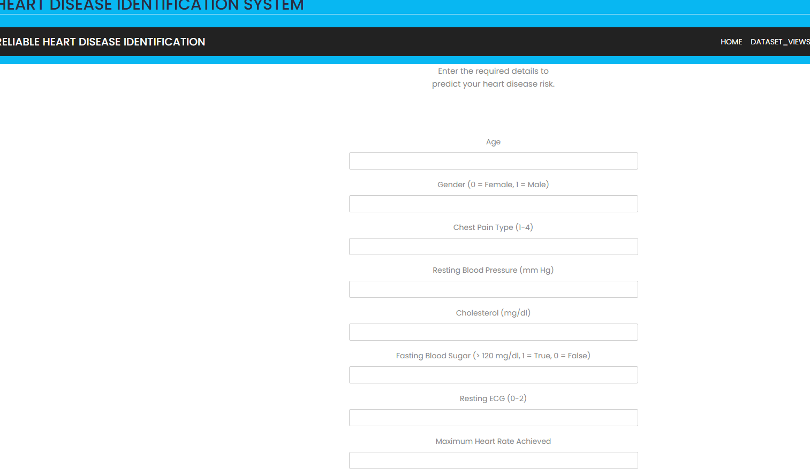
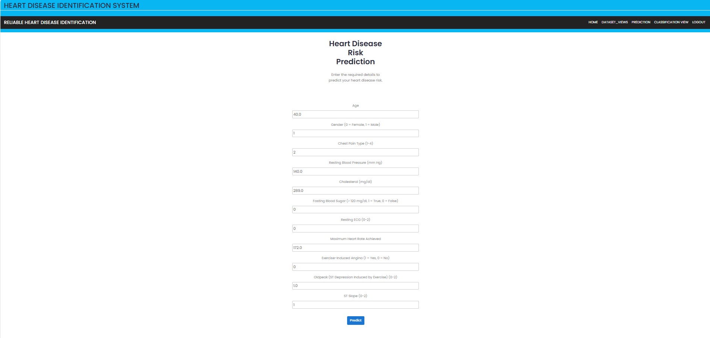
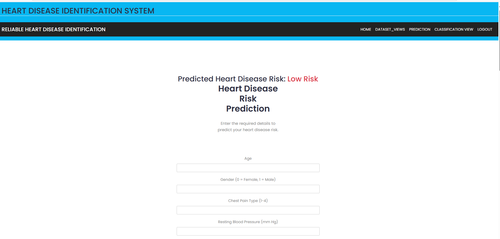

# Heart Disease Prediction

A machine learning based web application for predicting the possibility of heart disease. The project is developed using Django and provides separate user and admin sections.

The application allows users to register, log in, enter their health-related details, and get a heart disease prediction. It also includes an admin section for managing and viewing user-related information.
## Features

- User registration and login
- User dashboard
- Heart disease prediction using a trained machine learning model
- Prediction form for entering patient details
- Dataset included with the project
- Admin login and dashboard
- Admin user details section
- Django-based web application
- Pre-trained machine learning model
- Feature scaling using a saved scaler
## Technologies Used

- Python
- Django
- Machine Learning
- HTML
- CSS
- JavaScript
- SQLite
- Pandas
- NumPy
- Scikit-learn
## How the Project Works

1. The user opens the application.
2. The user creates an account through the registration page.
3. The user logs into the application.
4. The user enters the required health-related information.
5. The application processes the entered information.
6. The trained machine learning model uses the processed information to make a prediction.
7. The prediction result is displayed to the user.
8. The admin section can be used to view and manage user-related information.
## Project Structure

```text
heart-disease-prediction/
│
├── Admin/
│   ├── admin.py
│   ├── apps.py
│   ├── models.py
│   ├── tests.py
│   └── views.py
│
├── heart_disease_prediction_using_hybrid_ML/
│   ├── settings.py
│   ├── urls.py
│   ├── views.py
│   ├── asgi.py
│   └── wsgi.py
│
├── media/
│   └── heart-disease-dataset.csv
│
├── screenshots/
│   ├── screenshot-01.png
│   ├── screenshot-02.png
│   ├── screenshot-03.png
│   ├── screenshot-04.png
│   ├── screenshot-05.png
│   ├── screenshot-06.png
│   ├── screenshot-07.png
│   ├── screenshot-08.png
│   └── screenshot-09.png
│
├── templates/
│   ├── admin/
│   ├── users/
│   ├── assets/
│   ├── adminLogin.html
│   ├── base.html
│   ├── index.html
│   ├── register.html
│   └── userLogin.html
│
├── user/
│   ├── migrations/
│   ├── utility/
│   ├── admin.py
│   ├── apps.py
│   ├── models.py
│   ├── tests.py
│   └── views.py
│
├── best_model.pkl
├── scaler.pkl
├── db.sqlite3
├── manage.py
├── .gitignore
└── README.md
```

## Machine Learning Model

The project uses a pre-trained machine learning model stored in `best_model.pkl`.

The project also contains `scaler.pkl`, which is used for scaling the input values before they are passed to the model.

The dataset used by the application is stored in:

```text
media/heart-disease-dataset.csv
```

## Screenshots

### Home Page



### Registration



### Admin Page



### User Page



### Input Values







### Prediction Output





## How to Run the Project

### 1. Clone the Repository

```bash
git clone https://github.com/Yaswithai5/heart-disease-prediction.git
```

### 2. Open the Project Folder

```bash
cd heart-disease-prediction
```

### 3. Create a Virtual Environment

```bash
python -m venv venv
```

### 4. Activate the Virtual Environment

On Windows:

```bash
venv\Scripts\activate
```

### 5. Install Required Packages

```bash
pip install django pandas numpy scikit-learn
```

### 6. Apply Database Migrations

```bash
python manage.py migrate
```

### 7. Run the Django Server

```bash
python manage.py runserver
```

### 8. Open the Application

Open the following URL in your browser:

```text
http://127.0.0.1:8000/
```
## Dataset

The project uses a heart disease dataset stored in the `media` folder.

```text
media/heart-disease-dataset.csv
```
## Model Files

The trained machine learning model and scaler are included in the project.

```text
best_model.pkl
scaler.pkl
```
## Future Improvements

- Improve the user interface
- Add more detailed prediction information
- Add model performance metrics
- Add data visualizations
- Deploy the application online
- Improve authentication and security
- Compare the performance of multiple machine learning models
## Author

**Yaswithai5**

GitHub: [Yaswithai5](https://github.com/Yaswithai5)
